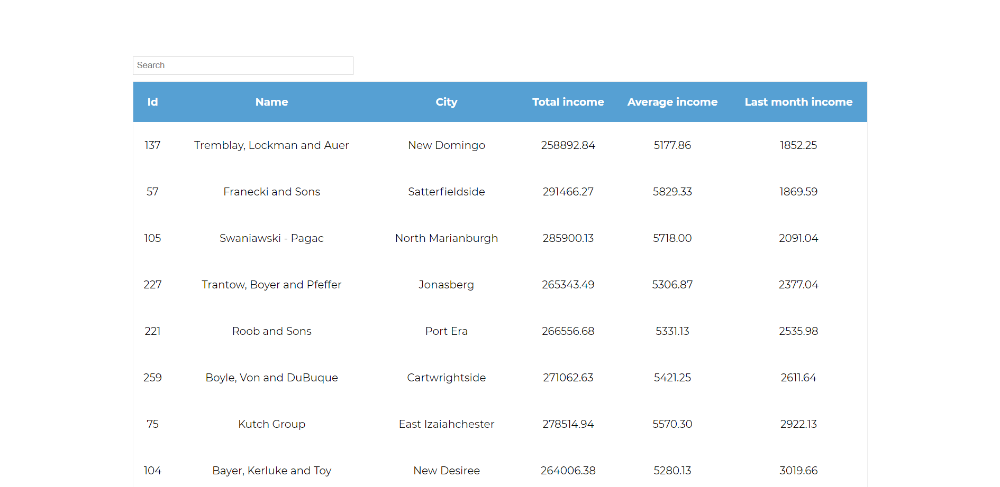
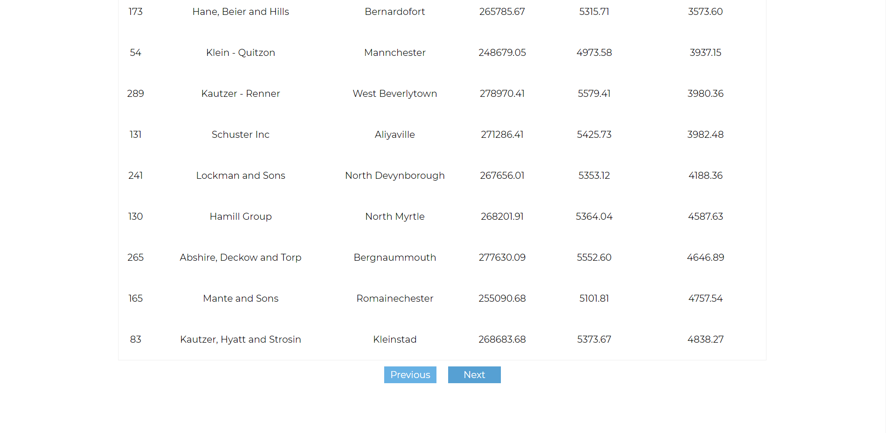

<!-- AUTO-GENERATED-CONTENT:START (STARTER) -->

<h1 align="center">
  Skygate Junior JS DEveloper task
</h1>


###Demo screenshots





***

### Project description

This project is a react application. This app uses styled components for styling. 
For managing state and async actions I used react hooks (useState, useEffect).
For fetching data from Api I used axios. 

 Application's logic is divided into several files. App.js is a root file. Another 
 components are nested in this component. When we open this app the companies list is presented.
 All data from ["https://recruitment.hal.skygate.io/companies"](https://recruitment.hal.skygate.io/companies)
 are fetched before component is mounted to DOM. After fetching data from `/companies` another axios get request
  from [https://recruitment.hal.skygate.io/incomes/]("https://recruitment.hal.skygate.io/incomes/") for each company is made.
   Data from `/incomes` are spread in companies array from `/companies`.
 
 We can search through the table by company name using input above the table. 
 When we started typing company name the companies list is being filtered.
 
 App provides sorting by selected criteria. By default companies list isn't sorted. When we 
 click on selected header (total income, average income, last month income) companies list
 is sorted and the structure of companies presented in companies list is changing. When we
 first click on selected header the companies list is sorting ascending by selected criteria.
 After second click the companies list is sorting descending.
 
 

 


***
###Technologies
1. ReactJS
1. Styled Components

***
###Opening project


1.  **Start developing.**

    Navigate into your new site’s directory and start it up.

    ```shell
    cd skygate/
    npm start
    ```

1.  **Open the source code and start editing**

    App is now running at `http://localhost:3000/`

    
    
  ***

###Project structure

A quick look at the top-level files and directories you'll see in a Gatsby project.

   
    ├── src
        ├── assets
            ├── images
            ├── colors.js
            ├── globalStyles.js
        ├── components
            ├── companiesList
                ├── companiesList.js
                ├── companyPreview
                    ├── companyPreview.js
            ├── loadingAnimation
                ├── loadingAnimation.js
            ├── paginationButtons
                ├── paginationButtons.js
            ├── UIComponents
                ├── Button.js
        
 
  **`/src`**: This directory will contains all of the code related to what you will see on the front-end of your site (what you see in the browser) such as your site header or a page template. `src` is a convention for “source code”.

   **`/assets`**: This directory contains all assets including global styles and images.
   
   **`/images`**: This directory contains all images which are used in README.md.
   
   **`color.js`**: This file contains color variables which are used in project.
   
   **`globalStyles.js`**: This file contains styled-components global style component which defines global styles in the app.
    
   **`/components`**: This directory will contain components
    
   **`/companiesList`**: This directory contains **`/companyPreview`** directory and **`companiesList.js`** file. 
    
   **`companiesList.js`**: This file contains table in which all companies are presented. It also contains all whole logic connected to fetching and managing data from [https://recruitment.hal.skygate.io/companies]("https://recruitment.hal.skygate.io/companies")
    
  **`/companyPreview`**: This directory contains **`companyPreview.js`** file.
  
  **`companyPreview.js`**: This file is a react component which is a single row in
  table from **`companiesList.js`** file. This component presents id, name, city,
  total income, average income and last month income of selected company. 


  **`/loadingAnimation`**: This directory contains **`loadingAnimation.js`** file

 **`loadingAnimation.js`** This file contains react component which is displayed when
 fetching data is not yet completely  fetched 

 **`/paginationButtons`**: This directory contains **`paginationButtons.js`** file

 **`paginationButtons.js`**: This file contains react component which is used in
 table pagination in **`companiesList.js`**.
 
 **`/UIComponents`**: This file contain **`Button.js`** file and should contains 
 in the future all reusable UI components

<!-- AUTO-GENERATED-CONTENT:END -->
