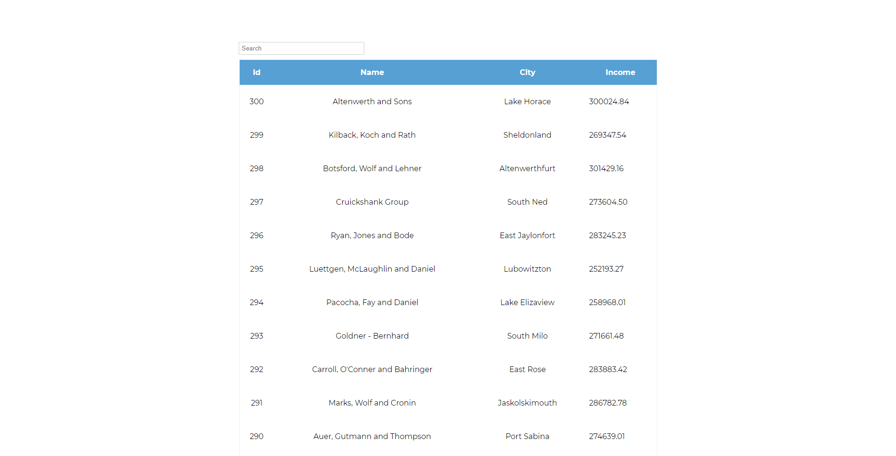

<!-- AUTO-GENERATED-CONTENT:START (STARTER) -->
<p align="center">
 
</p>
<h1 align="center">
  Skygate internship test task
</h1>


###Demo screenshots



***

### Project description

This project is a react application. This app uses styled components for styling. 
For managing state and async actions I used react hooks (useState, useEffect).
For fetching data frm api I used axios. For routing I used react-router. On route **`("/")`**
we have companiesList component which contains table with all companies. After clicking
on selected company preview we are redirected to route **`(/company/:id)`**

 Application's logic is divided into several files. App.js is a root file. Another 
 components are nested in this component. When we open this app we starts in route **`("/")`**
 and companiesList component is being displayed. All data from ["https://recruitment.hal.skygate.io/companies"](https://recruitment.hal.skygate.io/companies)
 are fetched before component is mounted to DOM. Data are being stored in an array.
 By default table is paginated and there are 20 companies on each page of the table.
 We can search through the table by company name using input above the table. 
 When we started typing company name the companies list is being filtered.
 
 
 After clicking on selected company we are redirected to **`(/company/:id)`** and 
 data from [https://recruitment.hal.skygate.io/incomes/]("https://recruitment.hal.skygate.io/incomes/")
 are being fetched. At the same time total income, average income and last month income
 are being calculated. We can choose by using date inputs period of time in which we
 want to calculated income. When we click on button "Show incomes" we can see
 a list which contains all incomes in selected period of time. By default app 
 displays all incomes.
 


***
###Technologies
1. ReactJS
1. Styled Components

***
###Opening project


1.  **Start developing.**

    Navigate into your new site’s directory and start it up.

    ```shell
    cd skygate/
    npm start
    ```

1.  **Open the source code and start editing**

    App is now running at `http://localhost:3000/`

    
    
  ***

###Project structure

A quick look at the top-level files and directories you'll see in a Gatsby project.

   
    ├── src
        ├── assets
            ├── images
            ├── colors.js
            ├── globalStyles.js
        ├── components
            ├── companiesList
                ├── companiesList.js
                ├── companyPreview
                    ├── companyPreview.js
            ├── company
                ├── company.js
                ├── companyContent
                    ├── companyContent.js
            ├── loadingAnimation
                ├── loadingAnimation.js
            ├── paginationButtons
                ├── paginationButtons.js
            ├── UIComponents
                ├── Button.js
        
 
  **`/src`**: This directory will contains all of the code related to what you will see on the front-end of your site (what you see in the browser) such as your site header or a page template. `src` is a convention for “source code”.

   **`/assets`**: This directory contains all assets including global styles and images.
   
   **`/images`**: This directory contains all images which are used in README.md.
   
   **`color.js`**: This file contains color variables which are used in project.
   
   **`globalStyles.js`**: This file contains styled-components global style component which defines global styles in the app.
    
   **`/components`**: This directory will contain components
    
   **`/companiesList`**: This directory contains **`/companyPreview`** directory and **`companiesList.js`** file. 
    
   **`companiesList.js`**: This file contains table in which all companies are presented. It also contains all whole logic connected to fetching and managing data from [https://recruitment.hal.skygate.io/companies]("https://recruitment.hal.skygate.io/companies")
    
    

  **`/companyPreview`**: This directory contains **`companyPreview.js`** file.
  
  **`companyPreview.js`**: This file is a react component which is a single row in
  table from **`companiesList.js`** file. This component presents id, name, city and 
  total income of selected company. This file contains logic for fetching income from
  [https://recruitment.hal.skygate.io/incomes/]("https://recruitment.hal.skygate.io/incomes/")

  **`company/`**: This directory contains **`company.js`** file and **`companyContent/`** directory

 **`company.js`**: This file contains react component which is displayed after redirecting to company's page.
      This file contains also logic connected to fetching and calculating incomes.
      
  **`/companyContent`**: This directory contains **`companyContent.js`** file
    

  **`companyContent.js`**: This file contains react component which displays information
  about total income, average income and last month income. This component displays also 
  list of incomes in selected time period

  **`/loadingAnimation`**: This directory contains **`loadingAnimation.js`** file

 **`loadingAnimation.js`** This file contains react component which is displayed when
 fetching data is not yet completely  fetched 

 **`/paginationButtons`**: This directory contains **`paginationButtons.js`** file

 **`paginationButtons.js`**: This file contains react component which is used in
 table pagination in **`companiesList.js`**.
 
 **`/UIComponents`**: This file contain **`Button.js`** file and should contains 
 in the future all reusable UI components

<!-- AUTO-GENERATED-CONTENT:END -->
